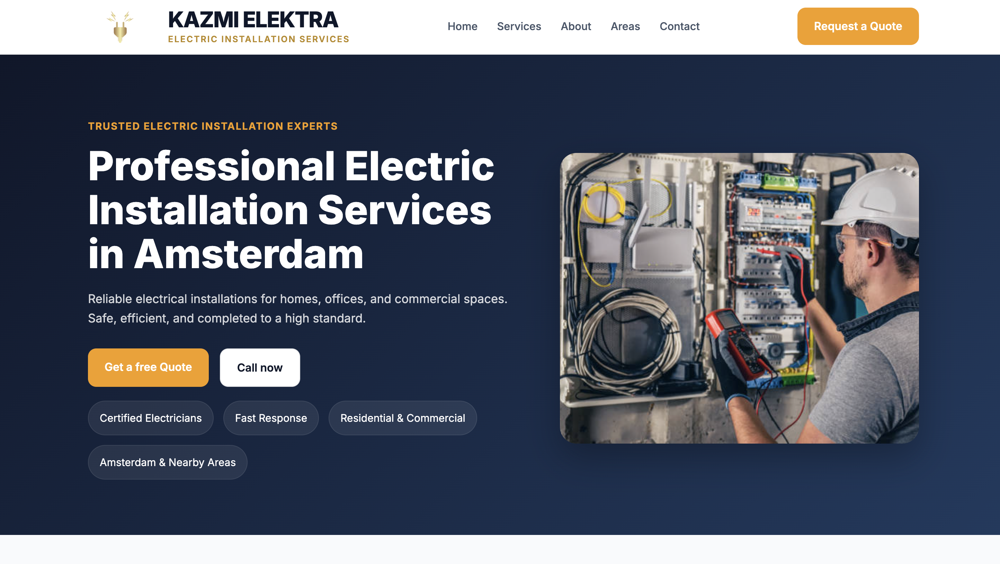

# Kazmi Elektra Website

A modern and responsive business website built for Kazmi Elektra, an electric installation services company based in Amsterdam.

## 🚀 Live Demo
https://kazmi-elektra.netlify.app/

## ✨ Features
- Responsive modern layout
- Professional business design
- Hero section with call-to-action
- Services showcase
- About section
- Service areas section
- Testimonials section
- Contact form
- Mobile responsive design

## 🛠️ Built With
- HTML5
- CSS3

## 📁 Project Structure

kazmi-elektra-website/
│
├── index.html
├── style.css
└── images/

## 📸 Website Preview

Example:

## 📍 Services
- Electrical Installations
- Lighting Installation
- Wiring & Rewiring
- Fuse Box Installation
- Maintenance & Repairs

## 🌍 Service Areas
Amsterdam and nearby areas.

## 👤 Author
Syed Mohsin Ali

## 📬 Contact
GitHub: github.com/ali-mohsin12